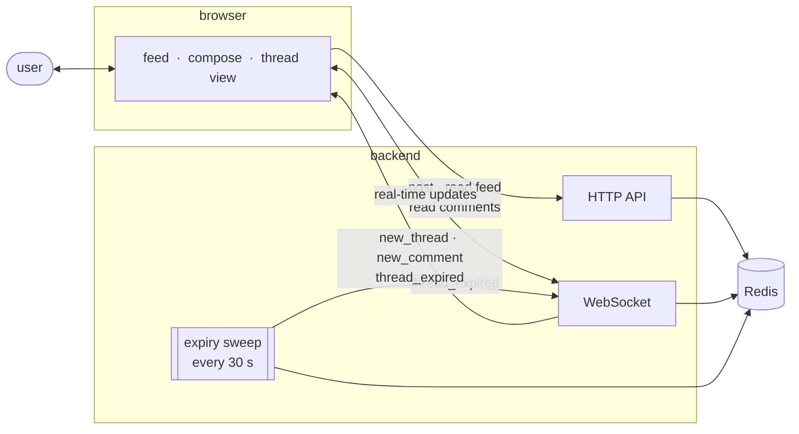

# hlv — hablan los vecinos

Anonymous, ephemeral, location-based messaging. No accounts, no history. Open it, post a message, see what people nearby are saying. Threads die if ignored.

---

## What it does

hlv is a public space for local conversation that disappears. Anyone within a chosen radius can read and reply to a thread. Threads expire after 30 minutes of inactivity, or after one hour regardless — whichever comes first. There are no usernames, no persistent profiles, and no archive.

The design is intentionally minimal: the app is useful for as long as a conversation is happening, and then it's gone.

---

## How it works

When a user opens the app, the browser requests their location. The frontend sends that location to the backend, which queries a geospatial index in Redis and returns nearby threads. A WebSocket connection is established at the same time, registering the client for real-time push events.

When a thread is posted, the backend stores it in Redis with a TTL and indexes its (fuzzed) coordinates. It then pushes a `new_thread` event over WebSocket to any connected client whose radius overlaps the posting location. The same pattern applies to new comments (`new_comment`).

A background task runs every 30 seconds, scans the index for thread keys that Redis has already expired, and broadcasts a `thread_expired` event so clients remove the thread from their feed automatically.

---

## Location handling

Location is treated as approximate and temporary.

- **Never stored raw.** Coordinates are fuzzed at post time before being written to Redis. Two layers are applied: the location is snapped to a ~100 m grid, then a random Gaussian offset is added (σ configurable by the user, 0–1000 m).
- **Not associated with the user.** There are no accounts, so coordinates cannot be linked to an identity.
- **Not used to track.** The backend only uses location to answer one question: is this thread close enough to this client? Once a thread expires, its record is deleted from Redis entirely.

---

## Stack

| Layer | Technology |
|-------|-----------|
| Frontend | SvelteKit (static SPA, SSR off) |
| Backend | Rust · axum · tokio |
| Database | Redis (hashes, geo set, lists) |
| Real-time | WebSocket (axum native) |

The frontend is a single-page app with no server-side rendering. All state is in-memory on the client, re-hydrated from the API on load. The backend is stateless except for Redis — the only in-memory structure is the map of active WebSocket clients, which is rebuilt automatically as connections are made.

See [`backend/README.md`](backend/README.md) for a detailed component diagram.

---

## Deployment

The frontend and backend are deployed independently and communicate over HTTP and WebSocket.

- **Frontend** — built as a static bundle and served from a CDN. No server required.
- **Backend** — containerised (Docker), deployed to a managed platform that provides an attached Redis instance and auto-deploys on push to `main`.

The frontend build bakes in the backend URL at compile time via an environment variable (`VITE_API_BASE`). No credentials or user data flow through the frontend build pipeline.
