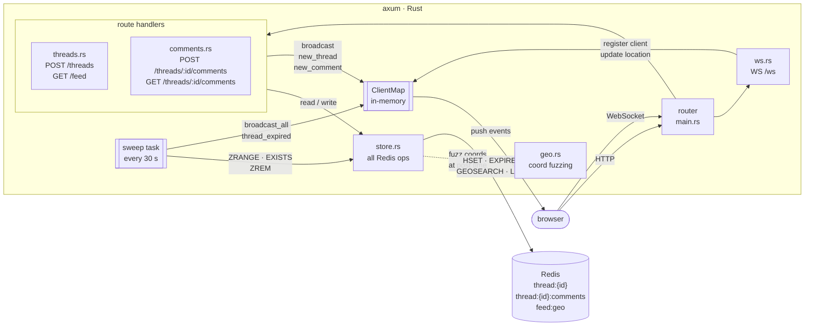

# hlv backend

Rust + axum. Handles HTTP routes, WebSocket connections, and a background expiry sweep. All state lives in Redis — no SQL database.

## Architecture

## Key data flows

**Posting a thread** — `POST /threads` → `threads.rs` fuzz the coordinates via `geo.rs`, save a hash + GEO entry in Redis with a 30-minute TTL, then broadcast `new_thread` to every WebSocket client within the poster's radius.

**Reading the feed** — `GET /feed?lat&lng&radius_km` → `GEOSEARCH` the geo set for IDs within radius, fetch each live thread hash, skip IDs whose key has already expired.

**Adding a comment** — `POST /threads/:id/comments` → a Lua script atomically pushes the comment, increments the reply count, and resets the thread TTL (capped at the 1-hour hard limit). Broadcasts `new_comment` to nearby clients.

**WebSocket** — client connects to `/ws` and sends `{lat, lng, radius_km}` to register. Server keeps the client in an in-memory `ClientMap` and pushes `new_thread`, `new_comment`, and `thread_expired` events as they happen.

**Expiry sweep** — a background task runs every 30 seconds, scans the geo set for thread IDs whose Redis key has expired, removes the stale geo entry, and broadcasts `thread_expired` to all connected clients so their feeds update without a page refresh.

## Redis schema

| Key | Type | TTL |
|-----|------|-----|
| `thread:{id}` | hash | 30 min inactivity, 60 min hard cap |
| `thread:{id}:comments` | list | mirrors thread TTL |
| `feed:geo` | sorted set (GEO) | none — stale entries removed by sweep |

## Location privacy

Coordinates are fuzzed before being stored — raw location is never persisted. Two layers applied at post time:

1. **Grid snap** — rounded to the nearest ~100 m cell
2. **Gaussian jitter** — random offset with σ = 0–1000 m (user-controlled via the precisión slider)
